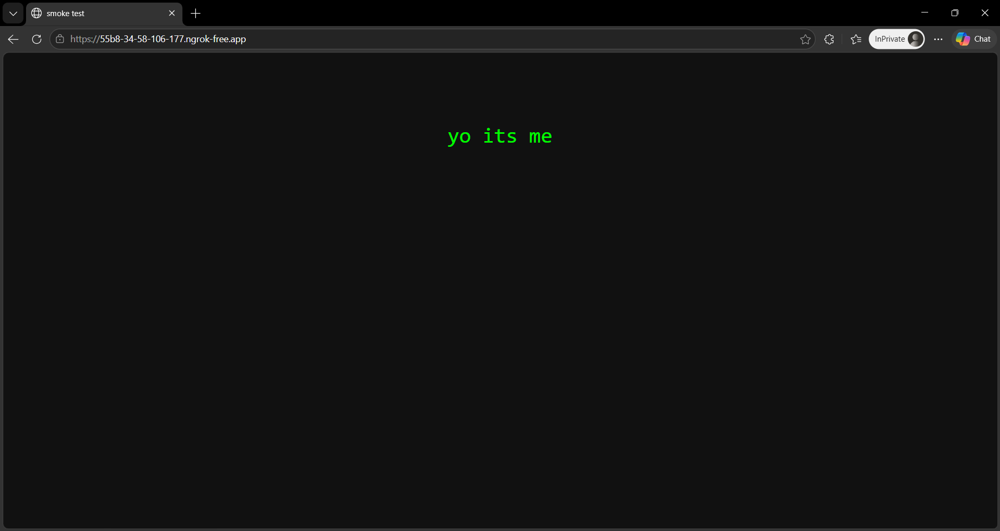

# 🌐 ngrok-host

A single shell script that points ngrok at any folder on your VPS and puts it on the internet in under 30 seconds. No config files to write. No web server to manage. Just run, paste your folder path, and share the public URL.

---

## 🎯 What It Does

- 📁 Serves **any local folder** over HTTP on a port you pick
- 🌐 Opens a public **ngrok HTTPS tunnel** to that port in seconds
- 🔑 Saves your ngrok auth token so you only enter it once
- 🔄 Auto-detects system arch and **installs ngrok** if it's missing
- ✅ Works on any VPS — Ubuntu, Debian, CentOS, Arch, Alpine, etc.
- 🛑 `Ctrl+C` cleanly kills both the tunnel and the HTTP server
- 📊 Live request log in the terminal so you see every hit
- 🌍 Optional region picker — US, EU, AP, AU, SA, JP, IN

---

## 🚀 Usage

```bash
chmod +x ngrok-host.sh
./ngrok-host.sh
```

That's it. The script walks you through four questions:

```
🔑  Enter your ngrok auth token:  <paste once, saved for next time>

📁  Path to the folder you want to host:  /var/www/myproject
                                         (Enter = current directory)

🔌  Local port:   8080    (Enter = default)

🌍  Region:       eu      (Enter = auto)
```

Then it prints:

```
══════════════════════════════════════════════════════════
  ✅  Your site is LIVE on the internet!
══════════════════════════════════════════════════════════

  Public URL  →  https://a3f8-12-34-56-78.ngrok-free.app

  Serving folder :  /var/www/myproject
  Local port     :  8080
  ngrok inspect  :  http://127.0.0.1:4040

══════════════════════════════════════════════════════════

  Anyone with that URL can now access your files.
  Press Ctrl+C to stop and close the tunnel.
```

---

## 📋 Requirements

| Requirement | Notes |
|-------------|-------|
| **Bash** | 4.0+ — comes with any modern Linux |
| **curl** or **wget** | For downloading ngrok (one will be present on any VPS) |
| **Python 3** | For the built-in HTTP server — pre-installed on most VPS images |
| **ngrok account** | Free — sign up at [dashboard.ngrok.com](https://dashboard.ngrok.com) to get your auth token |

The script checks for all of these at startup and tells you exactly what's missing.

---

## 🔑 Getting Your ngrok Auth Token

1. Go to [dashboard.ngrok.com/authtokens](https://dashboard.ngrok.com/authtokens)
2. Sign up (free)
3. Copy the token — paste it when the script asks
4. It gets saved to `~/.ngrok-host/authtoken.txt` — you only do this once

---

## 📁 What Gets Served

Everything in the folder you point to — exactly like a static web server.

| Folder contents | What visitors see |
|----------------|-------------------|
| `index.html` | That page loads at the root URL |
| `photo.jpg` | Direct download at `/photo.jpg` |
| `docs/report.pdf` | Accessible at `/docs/report.pdf` |
| No `index.html` | Directory listing — all files browsable |

This is ideal for:
- Sharing a build output or static site from your VPS
- Exposing a local API or web app running on a specific port
- Sending someone a file without cloud storage
- Testing webhooks (pair with `localhost` in your app)
- Demoing a project without deploying it

---

## ⚙️ How It Works

```
┌─────────────┐       HTTP        ┌──────────────────┐      HTTPS      ┌─────────────────┐
│  Your VPS   │  ──────────────▶  │  python3         │  ─────────────▶  │  Public URL     │
│  (folder)   │  localhost:8080   │  -m http.server  │  ngrok tunnel    │  (anyone)       │
└─────────────┘                   └──────────────────┘                  └─────────────────┘
```

1. Python's built-in `http.server` serves the folder over localhost
2. ngrok opens a secure tunnel from their edge to your local port
3. Visitors hit the public ngrok URL → traffic forwards to Python → files served

---

## 🔄 Saved Settings

| File | What's stored |
|------|---------------|
| `~/.ngrok-host/authtoken.txt` | Your ngrok auth token (chmod 600) |
| `~/.ngrok-host/http.log` | HTTP server output (last session) |
| `~/.ngrok-host/ngrok.log` | ngrok output (last session) |

On the next run the script asks: `Use saved token? [Y/n]` — hit Enter to skip re-typing it.

---

## 🛑 Stopping

Press `Ctrl+C`. The script catches the signal and kills both the HTTP server and the ngrok process before exiting. The public URL goes dead immediately.

---

## 🔧 Advanced: Running in the Background

If you want to keep the tunnel running after you close your SSH session, wrap it with `tmux` or `screen`:

```bash
tmux new -s host
./ngrok-host.sh
# Ctrl+B then D to detach — tunnel stays alive
```

To reconnect:
```bash
tmux attach -t host
```

---

## ✅ Live Test — Verified

Tested live on April 24, 2026. A folder with a single `index.html` was served via the host, tunneled through ngrok, and loaded in a browser over the public internet.

**Terminal output:**
```
══════════════════════════════════════════════
  ✅  LIVE: https://55b8-34-58-106-177.ngrok-free.app
══════════════════════════════════════════════
```

**Browser confirmation:**



URL in the address bar: `https://55b8-34-58-106-177.ngrok-free.app`  
Page content: served from a local folder, live on the internet in under 4 seconds.

---

## 🌍 Supported Architectures

| CPU | Supported |
|-----|-----------|
| x86_64 (most VPS) | ✅ |
| ARM64 (Raspberry Pi, AWS Graviton) | ✅ |
| ARMv7 (older Pi) | ✅ |
